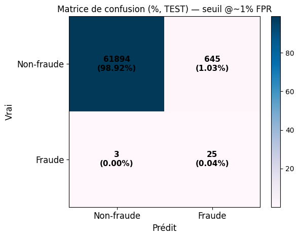
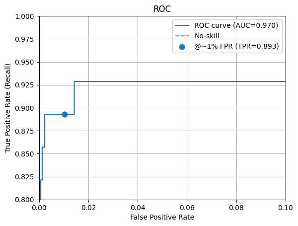
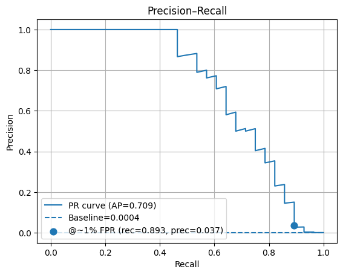
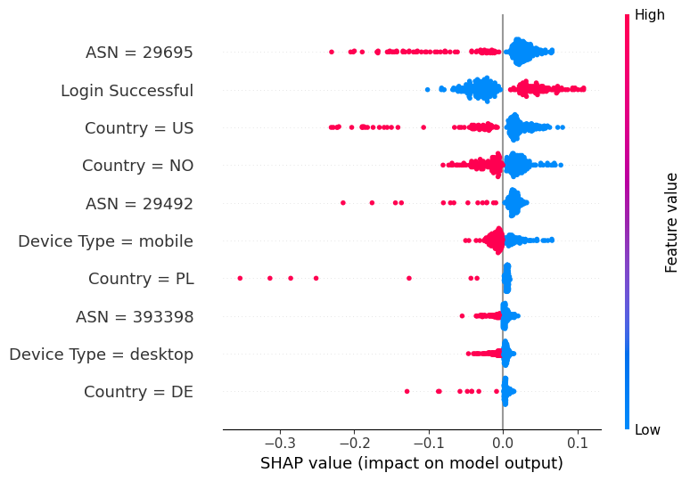

# 🔐 Détection d'Account Takeover (ATO) — Machine Learning avec PySpark & Scikit-Learn

## 🎯 Objectif du projet

Ce projet vise à **détecter les tentatives de prise de contrôle de compte (Account TakeOver)** à partir de logs d’authentification utilisateur.  
Les données proviennent du dataset **RBA Dataset** de Kaggle, comprenant plus de **33 millions de lignes**, simulant des connexions légitimes et malveillantes dans un contexte de cybersécurité.

L’objectif est de construire un **modèle robuste et interprétable** capable d’identifier les comportements anormaux tout en limitant les faux positifs (FPR ≈ 1%).

---

## ⚙️ Stack technique

| Domaine | Outils utilisés |
|----------|----------------|
| Préparation & analyse | PySpark, Pandas |
| Modélisation | Scikit-Learn (MLPClassifier, Logistic Regression, XGBoost) |
| Évaluation | ROC-AUC, PR-AUC, Recall@1%FPR |
| Interprétabilité | SHAP values |
| Visualisation | Matplotlib, Seaborn |
| Environnement | Jupyter Notebook, Python 3.11 |

---

## 🧩 Pipeline complet

1. **Prétraitement**
   - Nettoyage et imputation des valeurs manquantes  
   - Création de variables temporelles (`hour`, `dayofweek`, `is_weekend`)  
   - Variables de comportement (`is_new_country`, `time_since_last_login`)  
   - Encodage OHE (avec `min_frequency=10`)  
   - Normalisation avec `StandardScaler`

2. **Modélisation**
   - Entraînement d’un **MLPClassifier** optimisé (`alpha=3e-3`, `learning_rate_init=1e-3`)  
   - Recherche d’hyperparamètres via `RandomizedSearchCV`
   - Poids d’équilibrage (`class_weight="balanced"`) et oversampling contrôlé  

3. **Évaluation**
   - **PR-AUC = 0.709**  
   - **ROC-AUC = 0.97**  
   - **Recall@1%FPR ≈ 0.89**  
   - Analyse des seuils optimaux (1% FPR, max-F1, min-cost)

4. **Interprétation**
   - Analyse des **features importantes** via SHAP  
   - Identification des pays, ASN et types d’appareils à risque

---

## 📊 Résultats principaux

| Indicateur | Train | Test |
|-------------|-------|------|
| **AUC-ROC** | 0.9949 | 0.9696 |
| **PR-AUC** | 0.7585 | 0.7092 |
| **Recall@1%FPR** | 0.991 | 0.893 |
| **Precision@1%FPR** | 0.037 | 0.042 |

> **Seuil choisi : 0.0191 (≈ 1% de faux positifs)**  
> → Bon équilibre entre rappel élevé et faible taux de fausses alertes.

---

## 📈 Visualisations

| Graphique | Description |
|------------|-------------|
|  | Répartition des prédictions correctes et erreurs à 1% FPR. |
|  | Courbe ROC avec AUC = 0.97 et point @1% FPR (TPR = 0.893). |
|  | Courbe Precision-Recall : bon rappel malgré un déséquilibre fort. |
|  | Interprétabilité : top variables influentes sur la détection. |
|  | Exemple de sortie finale du modèle et métriques clés. |

---

## 🧠 Interprétation SHAP

Les attributs les plus influents sur la détection de fraude :
- **ASN (réseau d’origine)** : certains ASN associés à des anomalies.
- **Login Successful** : indicateur clé d’accès suspect.
- **Country (US, NO, PL, DE)** : importance géographique dans la détection.
- **Device Type** : différences notables entre mobile, desktop, tablet.

---

## 💾 Sauvegarde et déploiement

Le modèle final est sauvegardé au format `.joblib` :

```python
import joblib
model = joblib.load("mlp_ato_model.joblib")
